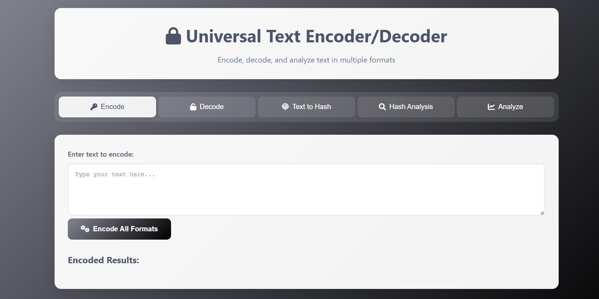

# 🔐 Universal Text Encoder/Decoder

[](https://opensource.org/licenses/MIT)
[](https://github.com/AbdullahAbbasi11/encoder-decoder/stargazers)
[](https://github.com/AbdullahAbbasi11/encoder-decoder/network/members)
[](https://github.com/AbdullahAbbasi11/encoder-decoder/issues)

A powerful and user-friendly web application for encoding, decoding, hashing, and analyzing text in multiple formats. This tool is perfect for developers, security professionals, and anyone who works with different text encoding schemes.



## ✨ Features

- **Multiple Encoding/Decoding Formats**:

  - Base64, Base32, Base16, Base85
  - URL, HTML, XML Encoding
  - ROT13, ROT47, Caesar, Atbash ciphers
  - Morse Code, Bacon Cipher
  - Binary, Hex, Octal, ASCII conversions
  - And many more!

- **Hashing Functions**:

  - MD5, SHA-1, SHA-256, SHA-512
  - SHA-3, RIPEMD-160
  - HMAC generation

- **Hash Analysis**:

  - Identify hash types
  - Hash length analysis
  - Character set analysis

- **Text Analysis**:
  - Character frequency
  - Word/character count
  - Encoding detection

## 🚀 Quick Start

### Option 1: Use Online

Simply open the [live demo](https://abdullahabbasi11.github.io/encoder-decoder/) in your browser and start using the tool immediately.

### Option 2: Run Locally

1. **Clone the repository**:

   ```bash
   git clone https://github.com/AbdullahAbbasi11/encoder-decoder.git
   cd encoder-decoder
   ```

2. **Open in your browser**:
   - Simply open the `index.html` file in your preferred web browser
   - Or use a local server:
     ```bash
     # Using Python's built-in server
     python -m http.server 8000
     # Then open http://localhost:8000 in your browser
     ```

## 🛠️ Usage

### Encoding Text

1. Go to the "Encode" tab
2. Enter your text in the input box
3. Click "Encode All Formats"
4. View the encoded results in different formats

### Decoding Text

1. Go to the "Decode" tab
2. Select the format (or choose auto-detect)
3. Enter the encoded text
4. Click "Decode" to view the original text

### Hashing Text

1. Go to the "Text to Hash" tab
2. Enter your text
3. Select the hash algorithm
4. View the generated hash

### Hash Analysis

1. Go to the "Hash Analysis" tab
2. Enter the hash value
3. View the analysis results including possible hash types

## 📝 Examples

### Encoding Example

```
Input: Hello, World!

Base64: SGVsbG8sIFdvcmxkIQ==
URL Encoded: Hello%2C%20World%21
ROT13: Uryyb, Jbeyq!
Morse Code: .... . .-.. .-.. --- --..-- / .-- --- .-. .-.. -.. -.-.--
```

### Hash Analysis Example

```
Input: 5d41402abc4b2a76b9719d911017c592

Possible Hash Types:
- MD5 (128 bits)
- MD4 (128 bits)
- MD2 (128 bits)
```

## 🛡️ Security Note

While this tool is great for learning and basic encoding/decoding tasks, please note:

- For sensitive data, consider using dedicated security tools
- Hashing is one-way only - hashes cannot be reversed to original text
- Always use strong, unique passwords and proper encryption for sensitive information

## 🤝 Contributing

Contributions are welcome! Please feel free to submit a Pull Request.

1. Fork the Project
2. Create your Feature Branch (`git checkout -b feature/AmazingFeature`)
3. Commit your Changes (`git commit -m 'Add some AmazingFeature'`)
4. Push to the Branch (`git push origin feature/AmazingFeature`)
5. Open a Pull Request

## 📄 License

Distributed under the MIT License. See `LICENSE` for more information.

## 👨‍💻 Author

**Abdullah Abbasi**

- GitHub: [@AbdullahAbbasi11](https://github.com/AbdullahAbbasi11)
- LinkedIn: [Your LinkedIn](https://linkedin.com/in/yourusername)
- Twitter: [@YourTwitter](https://twitter.com/yourusername)

## 🙏 Acknowledgments

- [CryptoJS](https://github.com/brix/crypto-js) - For cryptographic functions
- [Font Awesome](https://fontawesome.com/) - For beautiful icons
- [Google Fonts](https://fonts.google.com/) - For typography

---

⭐ Star this repository if you found it useful!

🔗 [Live Demo](https://abdullahabbasi11.github.io/encoder-decoder/) | [Report Bug](https://github.com/AbdullahAbbasi11/encoder-decoder/issues) | [Request Feature](https://github.com/AbdullahAbbasi11/encoder-decoder/issues)
